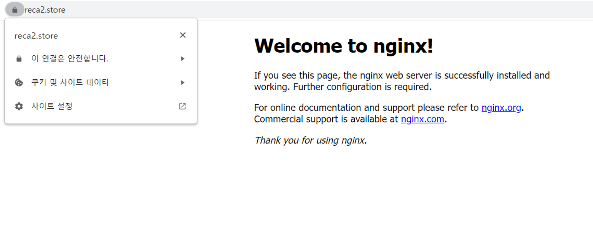

## AWS Architecture


## 목적
- Fargate에 웹/앱 서비스 배포
- Fargate(web - was) - RDS 연동으로 3tier 아키텍처 구축
- HPA AutoScaling 자동화
- CloudWatch Container Insights로 EKS 모니터링
- EKS Pod CPU Utilization 및 Memory Utilization 에 따른 SNS 알림
- ACM인증을 통한 Nginx Ingress(Network LoadBalancer)

## 구성

| 파일명 | 설명
|----------|-------------|
| 00. var.tf | terraform 파일에서 사용되는 변수
| 01. init.tf | terraform 설정 파일
| 02. vpc.tf | VCP 생성
| 03. eks.tf | EKS 클러스터, 노드그룹, IAM 역할 및 IAM 정책 생성
| 04. fargate.tf | fargate profile, fargate 배포, IAM 역할 및 IAM 정책 생성
| 05. sg.tf | 클러스터 및 데이터베이스 보안 그룹
| 06. bastion.tf | kubenetes 및 AWS CLI 설치된 bastion 생성
| 07. rds.tf | MariaDB RDS 생성
| 08. sns.tf | CloudWatch 메트릭, SNS 주제, SNS 구독 대상 지정

## 테스트
### 1. EKS 모니터링을 위한 Container Insights
- `bastion.tf` 배포 시 쉘 스크립트 자동 실행
- CLI로 EKS 클러스터 환경에 맞게 yaml 파일 수정 후 배포
    ```shell
    # eks.sh
    cd /home/ec2-user/ && git clone https://github.com/miracle-21/yaml_file.git
    sed -i 's/{{cluster_name}}/'${cluname}'/;s/{{region_name}}/'${region}'/;s/{{http_server_toggle}}/"'${FluentBitHttpServer}'"/;s/{{http_server_port}}/"'${FluentBitHttpPort}'"/;s/{{read_from_head}}/"'${FluentBitReadFromHead}'"/;s/{{read_from_tail}}/"'${FluentBitReadFromTail}'"/' /home/ec2-user/yaml_file/fluent-bit.yaml
    sudo -u ec2-user kubectl apply -f /home/ec2-user/yaml_file/fluent-bit.yaml
    ```
- 결과


### 2. CPU와 메모리 사용량에 따른 SNS 알림
- pod cpu utilization 경보 발생


- 설정한 대상의 이메일 주소로 알림 수신 확인


### 3. NLB에 ACM 등록
- `var.tf`에 등록된 변수 `ACM_ARN` 값에 따라 nginx controller 배포
